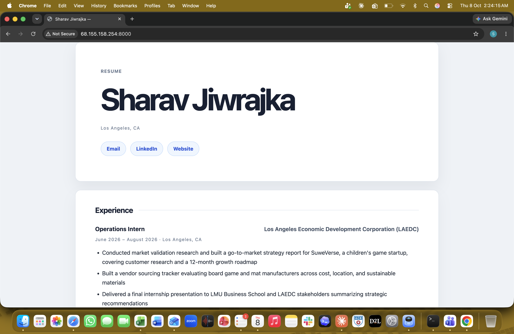

# Exercise 03 evidence

## 1. The VM

| Item | Value |
| --- | --- |
| VM name | `vm-career-platform` |
| Resource group | `rg-career-platform` |
| Region | Mexico Central |
| Size | `Standard_B2ts_v2` (2 vCPU, 1 GiB memory) |
| Public IP | 68.155.158.254 |

## 2. The site at the VM's IP

Taken at `http://68.155.158.254:8000` while the `Temp-HTTP-8000` rule was open and the app listened on `0.0.0.0`.

## 3. What went wrong and how I found it

When I clicked Review + create for my VM in West US 2, validation failed with `RequestDisallowedByAzure` on every resource, and the message only said the subscription could deploy to a limited set of regions. I did not know which regions those were, so I looked in the Azure portal under Policy, Assignments, and found an assignment called "Allowed resource deployment regions" with a list of five: Canada Central, Norway East, Mexico Central, Denmark East and Belgium Central. Canada Central was first on the list, but every size I wanted was greyed out there, so I changed the region to Mexico Central, which is also the closest to Los Angeles. In Mexico Central `Standard_B2ts_v2` was selectable, validation passed, and after I created the VM its overview page showed Location: Mexico Central and Status: Running. Later I confirmed the whole chain worked by getting `{"status":"ok"}` back from the VM's public IP, first on port 8000 and then through Nginx on port 80.

## 4. The change

My SSH rule only allows one address, the /32 of the network I set it up on, so at a coffee shop my public IP is different and the VM's firewall silently drops my packets, which is why the command hangs instead of showing an error. I would look up my current public IP, then in the Azure portal add or edit an inbound rule for port 22 with that new address as a /32, and delete or restore it when I leave. It costs a few minutes and a little extra exposure while the rule is open, and opening SSH to Any instead would be faster but would let anyone on the internet try to log in.
